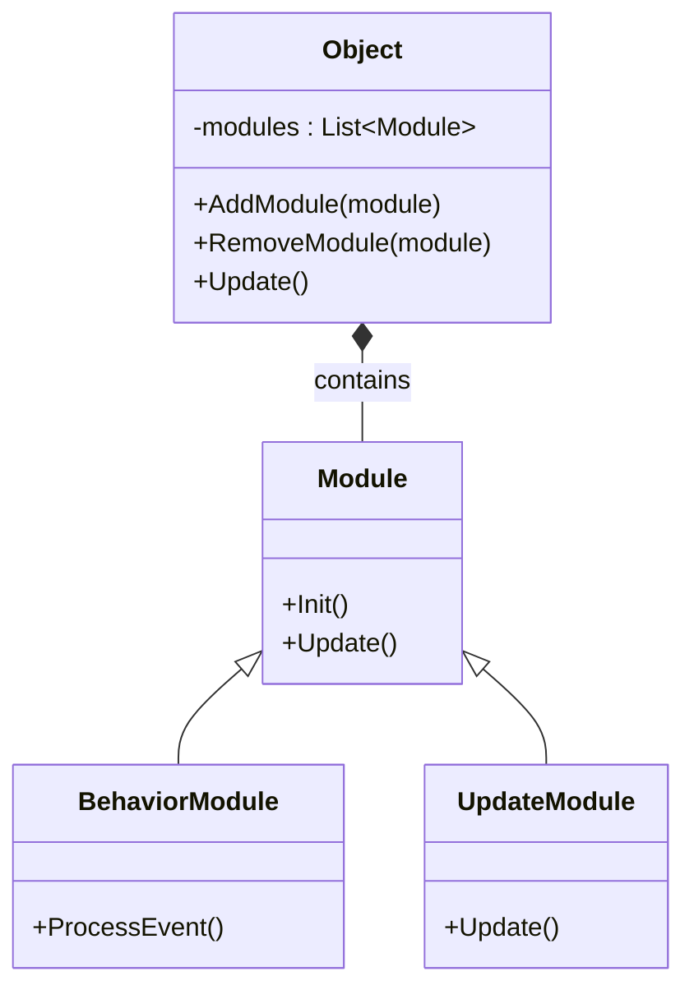
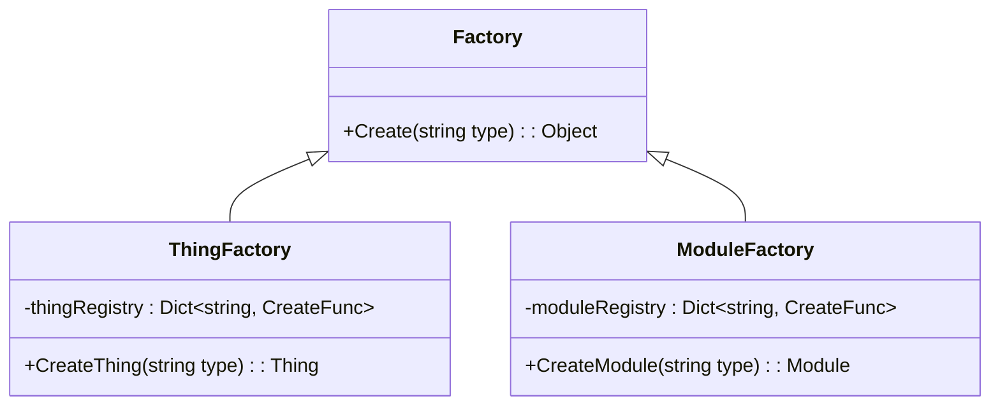
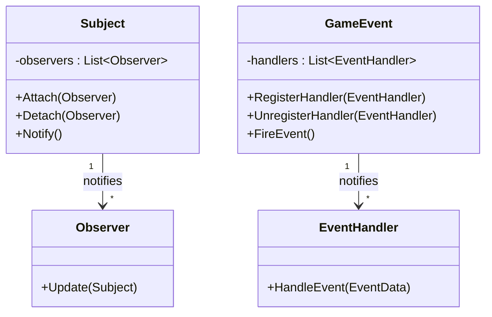
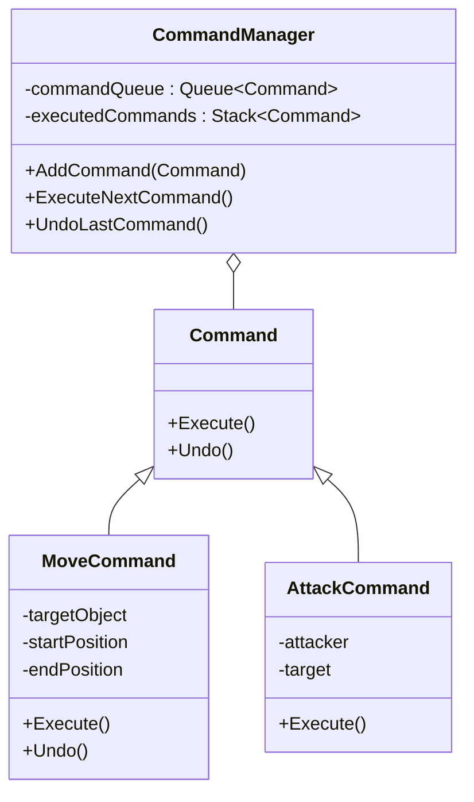
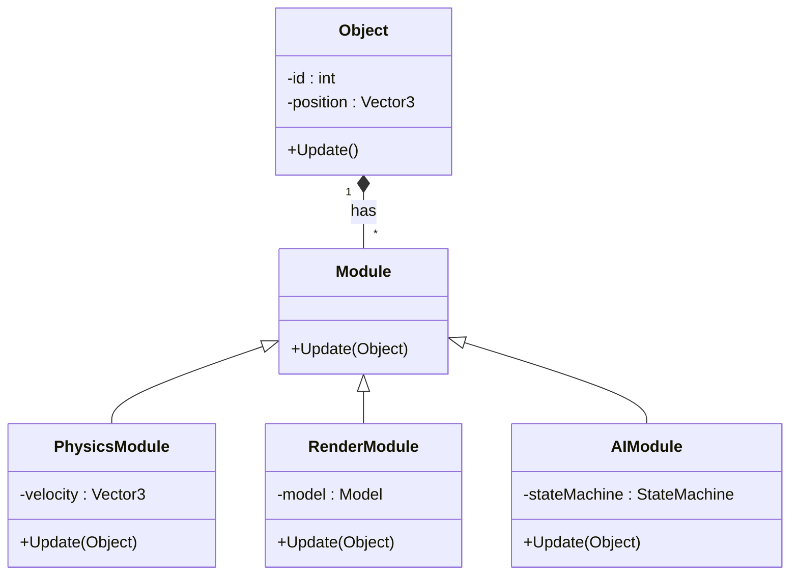
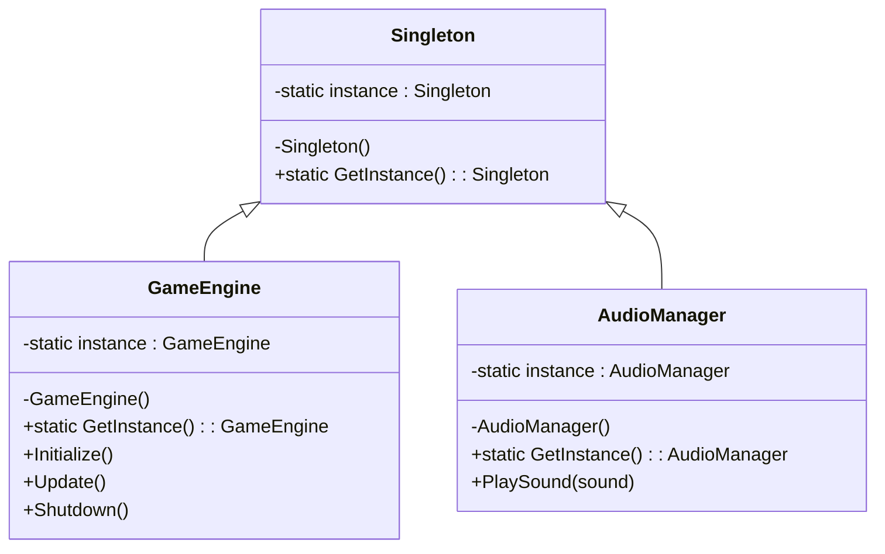

# Design Patterns in C&C Generals

This page documents the key design patterns used throughout the Generals codebase and how they contribute to the engine architecture.

::: warning DOCUMENTATION NOTICE
This document was generated with AI assistance and requires verification by engineering staff familiar with the codebase.
:::

## Module System Pattern

The Module System is the backbone of object composition in the Generals engine. It enables flexible behavior composition without deep inheritance hierarchies.



### Key Components
- `Module.h` - Base interface for all modules
- `UpdateModule.h` - Modules that need update calls each frame
- `BehaviorModule.h` - Complex behavior modules responding to events
- `ModuleFactory.h` - Creates modules from configuration

### Implementation Example

```cpp
// Object composition with modules
GameObject* unit = ThingFactory::CreateThing("Tank");
unit->AddModule(ModuleFactory::CreateModule("PhysicsUpdate"));
unit->AddModule(ModuleFactory::CreateModule("ArmorUpgrade"));
unit->AddModule(ModuleFactory::CreateModule("WeaponModule", "MainCannon"));
```

## Factory Pattern

Factories are used extensively for dynamic object creation throughout the codebase.



### Key Implementations
- `ThingFactory.h` - Creates game objects from templates
- `ModuleFactory.h` - Creates behavior modules
- `W3DAssetFactory.h` - Creates rendering assets

## Observer Pattern

The Observer pattern is used extensively for event notifications, particularly in the UI and game event systems.



### Implementation Areas
- UI event handling
- Game event notifications
- Network event processing
- Audio event triggering

## Command Pattern

Commands encapsulate actions for execution, network synchronization, and undo/redo support.



### Implementation Areas
- Input processing in `GameClient`
- Network command synchronization
- Action system in user interface
- Scripting engine

## Entity-Component System

The game uses a primitive form of an Entity-Component system through its module architecture.



### Implementation Details
- Objects act as entities with basic properties
- Modules act as components with specific behaviors
- System functionality is in separate manager classes

## Singleton Pattern

Several manager classes use the Singleton pattern for global access.



### Common Singletons
- `GameEngine` - Core engine instance
- `AssetManager` - Asset loading and caching
- `GameClient` - Client-side game representation
- `GameLogic` - Game logic processing

## Additional Patterns

- **State Machine Pattern** - Used for AI and object behavior
- **Façade Pattern** - Simplifies complex subsystems
- **Decorator Pattern** - Enhances object capabilities dynamically
- **Prototype Pattern** - Creates objects by cloning templates

## Anti-patterns to Be Aware Of

- **God Objects** - Some manager classes have too many responsibilities
- **Deep Inheritance** - Some class hierarchies are too deep
- **Tight Coupling** - Some components have unnecessary dependencies
