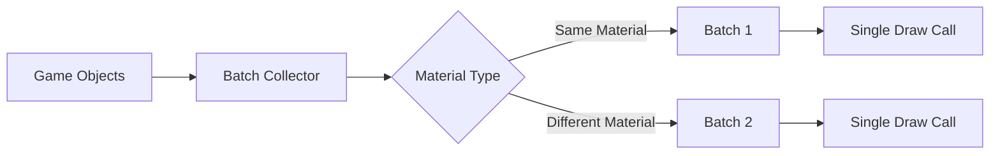
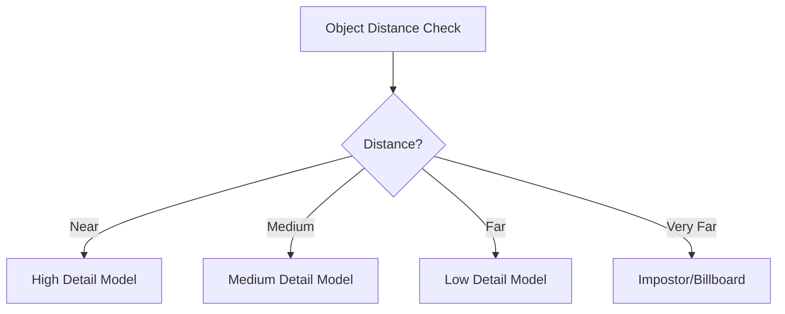
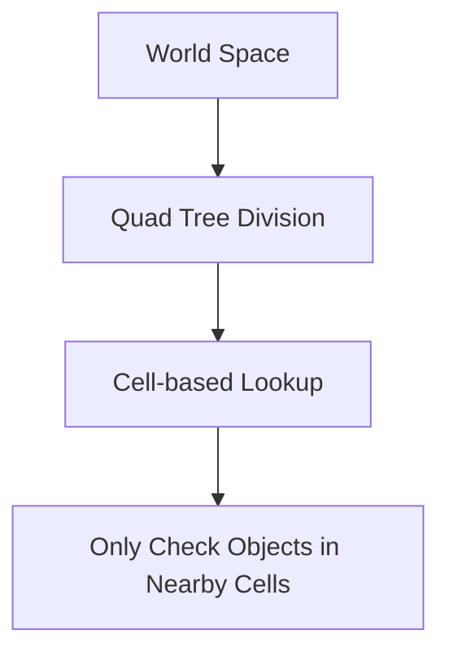

# Performance Optimizations

This page documents the performance optimization techniques used throughout the Generals engine.

::: warning DOCUMENTATION NOTICE
This document was generated with AI assistance and requires verification by engineering staff familiar with the codebase.
:::

## Memory Management

### Memory Pooling

The engine uses custom memory pools for frequently allocated objects to reduce heap fragmentation and allocation overhead.

```cpp
// Example memory pool usage
GameMemory::SetHeapPointer(GameMemory::HEAP_NORMAL);
GameObject* obj = (GameObject*)GameMemory::Allocate(sizeof(GameObject));
```

Key implementations:
- `GameMemory.h/cpp` - Core memory management system
- `HeapManager.h/cpp` - Heap management and tracking
- `MemoryPool.h/cpp` - Fixed-size object pools

### Memory Layout Optimization

Data structures are designed for cache efficiency with:
- Structure-of-arrays (SoA) pattern for batch processing
- Aligned memory allocations
- Minimized pointer chasing

## Rendering Optimizations

### Batching Systems

Draw call batching reduces API overhead:



Implementation in:
- `W3DBatchRender.h/cpp` - Batched rendering system
- `W3DTreeBuffer.h/cpp` - Tree batching
- `W3DBibBuffer.h/cpp` - Billboard batching

### LOD System

Level of Detail system reduces polygon count for distant objects:



Implementation in:
- `W3DModelLOD.h/cpp` - Model LOD management
- `GameLOD.h/cpp` - Game-level LOD settings

### Visibility Determination

Optimized visibility checks:
- View frustum culling
- Portal-based visibility
- Occlusion culling

Key files:
- `W3DVisibility.h/cpp` - Visibility determination
- `W3DOcclusionCulling.h/cpp` - Occlusion system

## Physics & Simulation

### Spatial Partitioning

Spatial partitioning reduces collision check complexity from O(n²) to O(n log n):



Implementation:
- `PartitionManager.h/cpp` - Spatial partitioning
- `PartitionSolver.h/cpp` - Collision detection

### Tiered Update System

Objects use a tiered update system based on importance:

- Every frame: Player units, active projectiles
- Every 2-3 frames: Nearby neutral objects
- Every 5-10 frames: Distant units, inactive objects
- On demand: Very distant or off-screen objects

## Network Optimization

### Delta Compression

Only transmit what has changed:


Implementation:
- `FrameData.h/cpp` - Frame delta encoding
- `NetCommandList.h/cpp` - Command batching

### Bandwidth Management

- Prioritized packet sending based on importance
- Data compression for network packets
- Latency hiding techniques

## Audio Optimizations

### Dynamic Sample Rate

Audio quality adjusts based on distance and importance:
- Full quality for nearby, important sounds
- Reduced quality for distant, background sounds

### Voice Limiting

Implements channel prioritization when many sounds play simultaneously:
- Important gameplay sounds get priority
- Similar sounds are culled or combined

Implementation:
- `AudioManager.h/cpp` - Sound management system
- `PriorityVector.h/cpp` - Sound prioritization

## File System Optimizations

### Asset Streaming

Streaming system loads data as needed:
- Background loading of assets
- Progressive terrain loading
- Texture streaming based on visibility

Implementation:
- `StreamingArchiveFile.h/cpp` - Streaming file access
- `AssetManager.h/cpp` - Asset streaming

## Profiling & Instrumentation

The engine includes built-in profiling tools:
- Frame timing measurements
- Memory usage tracking
- System bottleneck identification

```cpp
// Example profiling usage
PROFILE_BEGIN("AI Update");
UpdateAI();
PROFILE_END();
```

Implementation:
- `PerfTimer.h/cpp` - Performance timing
- `PerfMetrics.h/cpp` - Metrics collection
- `DebugDisplay.h/cpp` - Debug visualization

## Performance Tuning Options

The engine exposes various performance settings:
- LOD bias adjustments
- Draw distance controls
- Effect density settings
- Physics detail levels

These can be configured through:
- Command line parameters
- INI file settings
- In-game options menu
