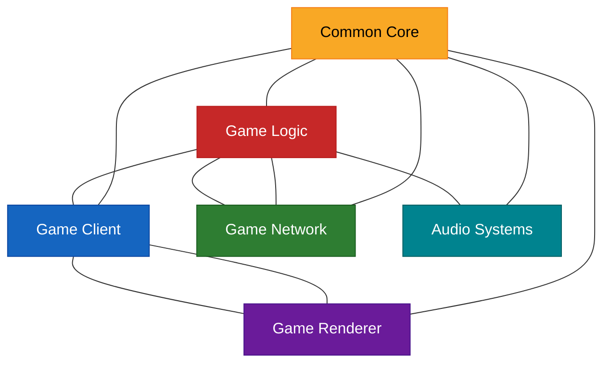
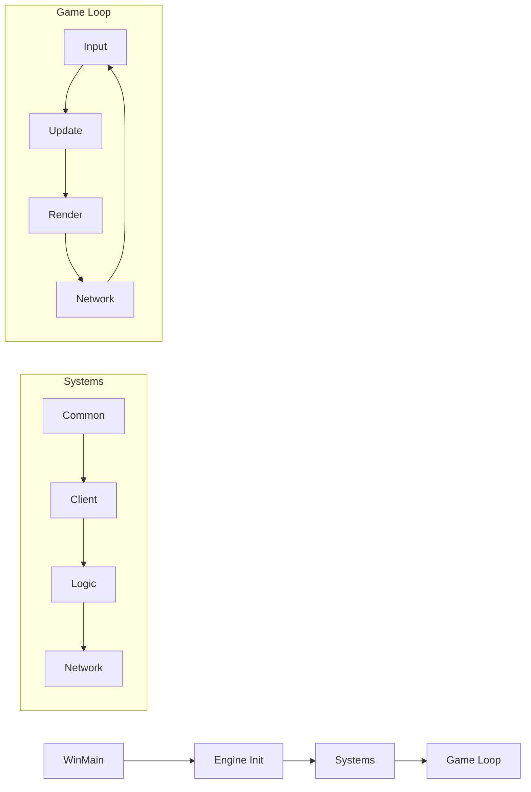
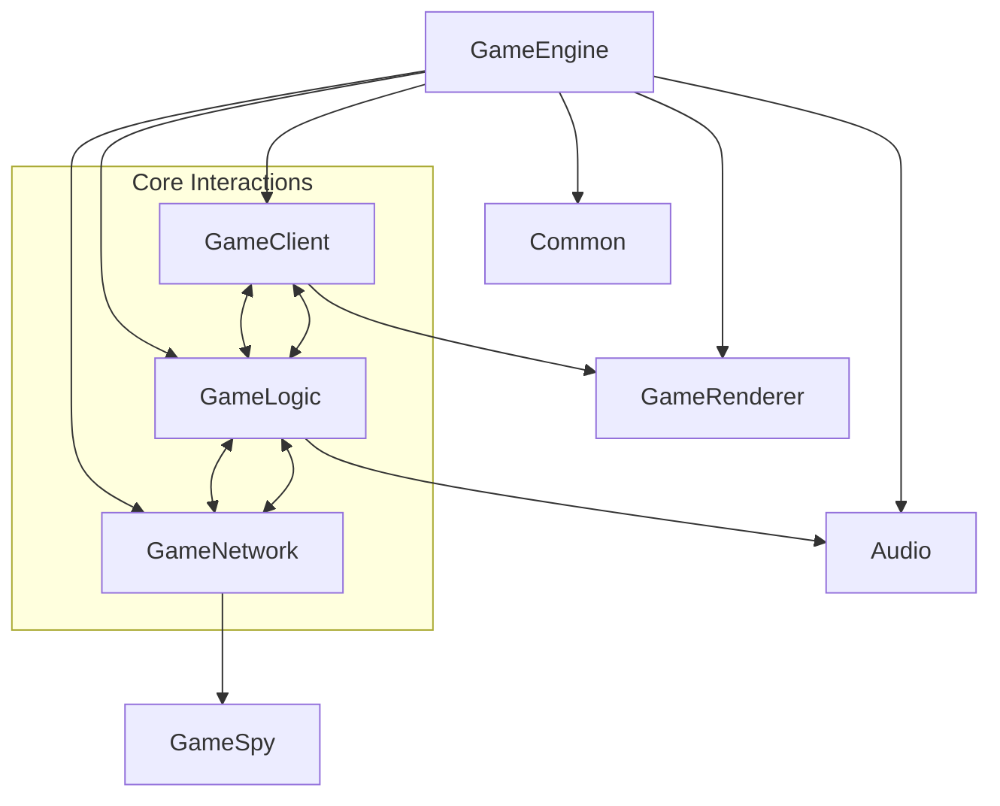

# C&C Generals: Zero Hour - System Overview

::: warning DOCUMENTATION NOTICE
This document was generated with AI assistance and requires verification by engineering staff familiar with the codebase.
:::

## Engine Architecture

The Command & Conquer Generals engine consists of eight primary interconnected systems that together form a modular game engine designed for real-time strategy gameplay.

::: details Architectural Diagram

:::

## Core Systems

| System | Documentation | Description |
|--------|---------------|-------------|
| **Common** | [Common System](../Engine/CoreSystems/Common.md) | Foundation services including memory management, file system, configuration, and core utilities |
| **GameClient** | [GameClient System](../Engine/CoreSystems/GameClient.md) | User interface, input handling, display management, and client-side game representation |
| **GameLogic** | [GameLogic System](../Engine/CoreSystems/GameLogic.md) | Game mechanics, object behavior, AI, physics, and simulation |
| **GameNetwork** | [GameNetwork System](../Engine/CoreSystems/GameNetwork.md) | Multiplayer connectivity, synchronization, and online services |
| **GameRenderer** | [GameRenderer System](../Engine/CoreSystems/GameRenderer.md) | 3D rendering through DirectX, visual effects, and scene management |
| **Audio** | [Audio Systems](../Engine/CoreSystems/Audio.md) | Sound and music playback with dual implementation (Miles Audio/OpenAL) |
| **Main** | [Main System](../Engine/CoreSystems/Main.md) | Application entry points, initialization, and core loops |
| **Tools** | [Tools System](../Engine/CoreSystems/Tools.md) | Development utilities for content creation and debugging |

::: info NOTE
"GameRenderer" is implemented in `Code/GameEngineDevice/Include/W3DDevice/` and may be referred to as "W3DDevice" in some documentation.
:::

## Design Philosophy

::: tip Key Design Principles
1. **Component Independence**
   - Each major system functions with minimal dependencies on other systems
   - Subsystems communicate through well-defined interfaces

2. **Module-Based Extensibility**
   - New functionality can be added through the module system
   - Behavior composition rather than deep inheritance hierarchies
   
3. **Runtime Configuration**
   - Systems are configurable via INI files and command-line parameters
   - Dynamic adaptation to hardware capabilities

4. **Performance-Focused Design**
   - Critical paths optimized for RTS requirements
   - Memory layout optimization for cache efficiency

5. **Deterministic Simulation**
   - Ensures consistent behavior across network play
   - Command-based synchronization system
:::

## System Initialization

The game initialization follows a carefully orchestrated sequence to ensure all dependencies are properly established:

::: code-group

```js [Initialization Sequence]
// Sequential initialization order
WinMain.h                  // Application entry point
  └─ GameEngine.h          // Engine creation and core initialization
      ├─ Common Systems    // Memory, file systems, core services
      ├─ GameClient        // Display setup, input devices, UI
      ├─ GameLogic         // Object systems, AI, physics
      ├─ GameNetwork       // Connection management, GameSpy
      └─ Main Game Loop    // Process input → Update → Render → Network
```
:::




## System Communication

<div class="feature-grid">
  <div class="feature-card">
    <h3>Direct Function Calls</h3>
    <p>Used for synchronous, performance-critical operations where immediate execution is required.</p>
  </div>
  <div class="feature-card">
    <h3>Event/Message System</h3>
    <p>For asynchronous communication and loose coupling between components.</p>
  </div>
  <div class="feature-card">
    <h3>Shared Data Structures</h3>
    <p>For efficient bulk data transfer between tightly coupled systems.</p>
  </div>
  <div class="feature-card">
    <h3>Command Objects</h3>
    <p>For operation encapsulation, queuing, and deterministic execution.</p>
  </div>
</div>


## Design Patterns

<div class="feature-grid">
  <div class="feature-card">
    <h3>Module System</h3>
    <p><strong>Composition-Based Object Behaviors</strong></p>
    <ul>
      <li>Base classes: <code>Module.h</code>, <code>UpdateModule.h</code>, <code>BehaviorModule.h</code></li>
      <li>Factory: <code>ModuleFactory.h</code></li>
      <li>Used by: <code>Object.h</code>, <code>GameLogic.h</code></li>
      <li>Enables flexible object composition with reusable behaviors</li>
      <li>Examples: <code>AIUpdate.h</code>, <code>PhysicsUpdate.h</code>, <code>WeaponBonusUpdate.h</code></li>
    </ul>
  </div>

  <div class="feature-card">
    <h3>Factory Pattern</h3>
    <p><strong>Dynamic Object Creation</strong></p>
    <ul>
      <li>Examples: <code>ThingFactory.h</code>, <code>ModuleFactory.h</code>, <code>W3DThingFactory.h</code></li>
      <li>Enables runtime object creation by name/type</li>
      <li>Facilitates data-driven design through INI configurations</li>
      <li>Supports mod-friendly extension points</li>
    </ul>
  </div>

  <div class="feature-card">
    <h3>Observer Pattern</h3>
    <p><strong>Event Notification</strong></p>
    <ul>
      <li>Used in: User interface, game events, network events</li>
      <li>Enables loose coupling between event sources and handlers</li>
      <li>Supports one-to-many communication with selective subscription</li>
      <li>Example: <code>GameClient</code>, <code>InGameUI</code>, <code>ShellHooks</code></li>
    </ul>
  </div>

  <div class="feature-card">
    <h3>Command Pattern</h3>
    <p><strong>Action Encapsulation</strong></p>
    <ul>
      <li>Core implementation: <code>ActionManager.h</code>, <code>MetaEvent.h</code></li>
      <li>Used for: Input processing, user interface, scripting</li>
      <li>Enables undo/redo, command queuing, and network synchronization</li>
      <li>Facilitates replay systems and deterministic multiplayer</li>
    </ul>
  </div>

  <div class="feature-card">
    <h3>Entity-Component</h3>
    <p><strong>Object Behavior Composition</strong></p>
    <ul>
      <li>Core implementation: <code>Object.h</code> with module system</li>
      <li>Entities (Objects) composed of behavior modules</li>
      <li>Enables flexible object behavior without deep inheritance</li>
      <li>Reduces coupling between object behaviors</li>
    </ul>
  </div>
</div>

## Key Subsystem Relationships

### Primary Interaction Paths



::: details Critical Interaction Pathways
#### Command Processing Pipeline
Player input → UI translation → Command objects → Network synchronization → Logic execution

#### Rendering Data Flow
Logic state → Scene representation → Visibility determination → Render commands → DirectX API

#### Audio Trigger System
Game events → Sound selection → Spatial positioning → Audio API

#### Network Synchronization
User commands → Command queue → Frame packaging → Network transmission → Remote execution
:::

## Performance Optimization

<div class="feature-grid">
  <div class="feature-card">
    <h3>Data-Oriented Design</h3>
    <ul>
      <li>Memory layout optimization for cache efficiency</li>
      <li>Linear arrays for batch processing</li>
      <li>Custom allocators for specific use cases</li>
      <li>Memory pooling for frequently allocated objects</li>
    </ul>
  </div>

  <div class="feature-card">
    <h3>Rendering Optimizations</h3>
    <ul>
      <li>View frustum culling</li>
      <li>Level of detail (LOD) system</li>
      <li>Draw call batching</li>
      <li>Pre-computed visibility</li>
      <li>Texture streaming</li>
    </ul>
  </div>

  <div class="feature-card">
    <h3>CPU Utilization</h3>
    <ul>
      <li>Prioritized update scheduling</li>
      <li>Deferred non-essential processing</li>
      <li>Frame budgeting for game systems</li>
    </ul>
  </div>

  <div class="feature-card">
    <h3>Memory Management</h3>
    <ul>
      <li>Zone-based allocation</li>
      <li>Reference counting</li>
      <li>On-demand asset loading</li>
      <li>Memory defragmentation</li>
      <li>Texture compression</li>
    </ul>
  </div>

  <div class="feature-card">
    <h3>Networking Efficiency</h3>
    <ul>
      <li>Delta compression</li>
      <li>Prioritized packet sending</li>
      <li>Bandwidth throttling</li>
      <li>Event bundling</li>
      <li>Latency hiding techniques</li>
    </ul>
  </div>
</div>

<style>
/* Unified styling system for feature cards */
.feature-grid {
  display: grid;
  grid-template-columns: repeat(auto-fit, minmax(280px, 1fr));
  gap: 20px;
  margin: 24px 0;
}

.feature-card {
  background-color: var(--vp-c-bg-soft);
  border-radius: 8px;
  padding: 20px;
  box-shadow: 0 2px 12px rgba(0,0,0,0.1);
  transition: transform 0.3s ease, box-shadow 0.3s ease;
}

.feature-card:hover {
  transform: translateY(-5px);
  box-shadow: 0 8px 16px rgba(0,0,0,0.1);
}

.feature-card h3 {
  margin-top: 0;
  color: var(--vp-c-brand);
  border-bottom: 1px solid var(--vp-c-divider);
  padding-bottom: 10px;
}

.feature-card ul {
  padding-left: 20px;
}

.feature-card code {
  background-color: var(--vp-c-bg-mute);
  padding: 2px 4px;
  border-radius: 4px;
}
</style>
