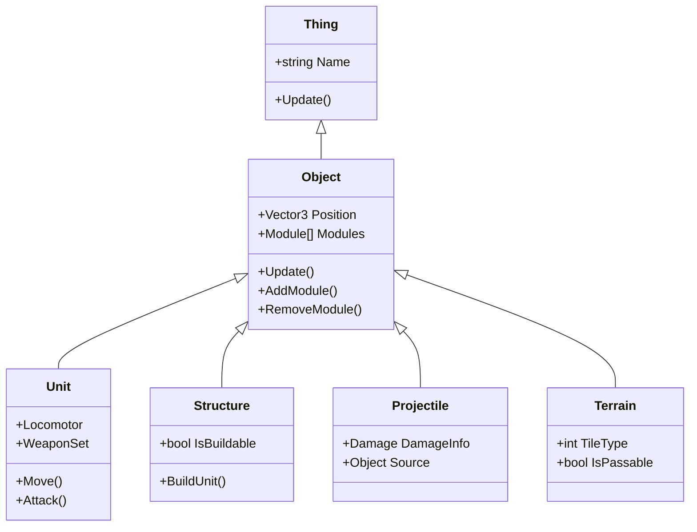
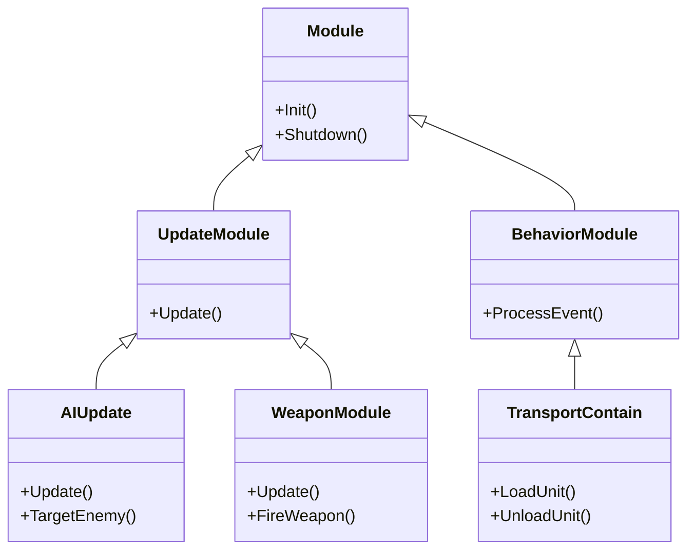
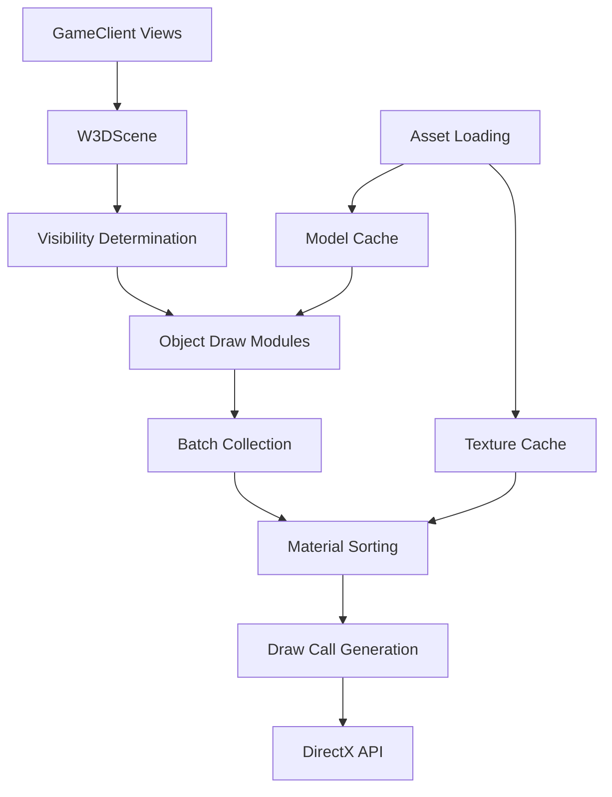

# Source Code Map

This page provides a high-level map of the C&C Generals: Zero Hour source code structure to help navigate the codebase.

::: warning DOCUMENTATION NOTICE
This document was generated with AI assistance and requires verification by engineering staff familiar with the codebase.
:::

## Directory Structure

```
Generals/
├── Code/
│   ├── GameEngine/           # Core engine systems
│   │   ├── Include/          # Public headers
│   │   │   ├── Common/       # Shared utilities and interfaces
│   │   │   ├── GameClient/   # Client-side systems
│   │   │   ├── GameLogic/    # Game mechanics and simulation
│   │   │   ├── GameNetwork/  # Networking and multiplayer
│   │   │   └── ...
│   │   └── Source/          # Implementation files
│   │       ├── Common/       
│   │       ├── GameClient/   
│   │       ├── GameLogic/   
│   │       ├── GameNetwork/  
│   │       └── ...
│   ├── GameEngineDevice/     # Rendering and device interface
│   │   ├── Include/
│   │   │   └── W3DDevice/    # 3D rendering interfaces
│   │   └── Source/
│   │       └── W3DDevice/    # DirectX implementation
│   ├── Libraries/            # Third-party and Westwood libraries
│   │   └── Source/
│   │       └── WWVegas/      # Vegas engine components
│   │           ├── WW3D2/    # 3D engine components
│   │           ├── WWDebug/  # Debugging systems
│   │           ├── WWLib/    # Core library functionality
│   │           ├── WWMath/   # Math library
│   │           ├── WWSave/   # Save/load system
│   │           └── ...
│   ├── Main/                 # Entry points and shell
│   │   ├── DebugWindow/      # Debug interface
│   │   ├── Setup/            # Installation tools
│   │   └── ...
│   └── Tools/                # Development tools
│       ├── WorldBuilder/     # Map editor
│       ├── ParticleEditor/   # Particle effect editor
│       └── ...
└── Data/                     # Game data assets
    ├── INI/                  # Game configuration files
    ├── Art/                  # Art assets
    ├── Audio/                # Sound files
    └── ...
```

## Key Source Files by System

### Common Core (Code/GameEngine/Include/Common/)

| File | Description |
|------|-------------|
| `GameEngine.h` | Main engine controller |
| `SubsystemInterface.h` | Interface for game subsystems |
| `GameMemory.h` | Memory management system |
| `FileSystem.h` | File system abstraction |
| `INI.h` | Configuration file parser |
| `Module.h` | Base behavior module interface |
| `Thing.h` | Base game object class |

### Game Logic (Code/GameEngine/Include/GameLogic/)

| File | Description |
|------|-------------|
| `GameLogic.h` | Main game logic system |
| `Object.h` | Game object implementation |
| `AI.h` | Artificial intelligence system |
| `Module/UpdateModule.h` | Base logic update module |
| `Module/BehaviorModule.h` | Complex behavior module |
| `Weapon.h` | Weapon system implementation |
| `Locomotor.h` | Movement system |

### Game Client (Code/GameEngine/Include/GameClient/)

| File | Description |
|------|-------------|
| `GameClient.h` | Main client system |
| `Display.h` | Display management |
| `View.h` | View system |
| `InGameUI.h` | In-game user interface |
| `ControlBar.h` | Command interface |
| `Gadget.h` | UI base element |
| `Mouse.h`/`Keyboard.h` | Input handling |

### Game Renderer (Code/GameEngineDevice/Include/W3DDevice/)

| File | Description |
|------|-------------|
| `dx8wrapper.h` | DirectX wrapper |
| `dx8renderer.h` | Core rendering system |
| `W3DScene.h` | Scene management |
| `W3DAssetManager.h` | Asset management |
| `W3DModelDraw.h` | Model rendering |
| `W3DTerrainVisual.h` | Terrain visualization |
| `W3DShaderManager.h` | Shader management |

### Game Network (Code/GameEngine/Include/GameNetwork/)

| File | Description |
|------|-------------|
| `Connection.h` | Network connection |
| `ConnectionManager.h` | Connection management |
| `FrameData.h` | Game state synchronization |
| `NetCommandList.h` | Command system |
| `GameSpyOverlay.h` | GameSpy integration |
| `LANAPI.h` | LAN support |
| `NAT.h` | NAT traversal |

### WW Vegas Libraries (Code/Libraries/Source/WWVegas/)

| Directory | Description |
|-----------|-------------|
| `WW3D2/` | 3D rendering foundation |
| `WWLib/` | Core utility functions |
| `WWMath/` | Mathematics library |
| `WWAudio/` | Audio system |
| `WWShade/` | Shader system |
| `WWDebug/` | Debugging utilities |
| `WWSave/` | Game state serialization |

## Object Model

The object hierarchy for game entities:



## Module System

The module system architecture:



## Renderer Pipeline

Simplified visualization of the rendering pipeline:



## Build System

The project uses a custom build system with multiple configurations:

- Debug: Full debugging information and assertions
- Release: Optimized builds for distribution
- Tools: Special builds for development tools
- Profile: Performance measurement builds

## Entry Points

Main application entry points:

- `WinMain.cpp` - Main game executable entry
- `WorldBuilder.cpp` - Map editor entry
- `ParticleEditor.cpp` - Particle effect editor entry

## Further Navigation

- See [System Overview](../Overview.md) for high-level architecture
- See [Build Guides](../Builds/Windows/vs22_compile.md) for compilation instructions
- See [Tools System](../Tools.md) for developer tools documentation
